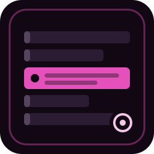

<p align="center">
  
</p>

<p align="center">
  <strong>jev-logtriage</strong><br>
  <a href="https://docs.typesafe.ai/introduction/quickstart">Jev</a> decides whether a batch of logs is worth acting on.<br>
  Your code keeps the thresholds. Nothing is executed.
</p>

<p align="center">
  <a href="https://pypi.org/project/jev-logtriage/"></a>
  <a href="https://github.com/jyatesdotdev/jev-logtriage/blob/main/LICENSE"></a>
  <a href="https://docs.typesafe.ai/introduction"></a>
  <a href="https://www.python.org/"></a>
</p>

<p align="center">Independent. Not an official TypeSafe AI project.</p>

```text
logs  ->  collapse  ->  jev (6 questions, one call)  ->  code gates
                                                         |
                         suppress | watch | review | notify | page
```

Prometheus is good at conditions you already know how to write in PromQL. This is for the rest. Repeated benign warnings get `suppress`. A helm reconcile error and a failed ntfy push get `notify`. Low confidence never auto-acts. It goes to `review`.

## Try it

Needs [uv](https://docs.astral.sh/uv/) and a [TypeSafe API key](https://console.typesafe.ai/settings/keys). Loki is not required.

No clone:

```bash
export TYPESAFE_API_KEY=apikey_...
uvx --from jev-logtriage logtriage --demo
```

From this repo:

```bash
export TYPESAFE_API_KEY=apikey_...
uv run logtriage --demo
```

`uv run` creates `.venv`, installs `uv.lock`, and runs the script. Python 3.10+ is enough.

Without uv:

```bash
pip install jev-logtriage
export TYPESAFE_API_KEY=apikey_...
logtriage --demo
```

`--demo` loads bundled fixtures (`logtriage/fixtures/demo.json`), a sanitized hour of homelab warn/error lines, and runs the same pipeline a Loki query would.

```text
DECISION                  SEV  PRIO  CONF CATEGORY         SOURCE
-----------------------------------------------------------------
notify                    2.0  0.47  0.80 network          alertmanager
notify                    2.1  0.44  0.80 security         forgejo-runner
notify                    1.8  0.42  0.73 network          helm-controller
notify                    1.2  0.29  0.73 config           authentik
watch                     1.4  0.42  0.38 infra            coredns
watch                     0.6  0.19  0.54 expected_noise   news-linker
suppress                  0.6  0.17  0.54 expected_noise   kube-state-metrics
```

Numbers move a little from run to run. The gates do not.

## What Jev decides

One System One call per source. Question ids are not sent to the model. The instructions are.

| id | type | question |
| --- | --- | --- |
| `is_routine_noise` | noul | would an on-call engineer dismiss this? |
| `severity` | score | 0 routine to 3 critical |
| `impact_scope` | score | 0 one pod to 3 cluster-wide |
| `needs_action` | noul | should a human do something? |
| `auto_remediable` | noul | is there a safe, unambiguous automated fix? |
| `category` | choice | app_error, resource, infra, network, config, security, expected_noise |

Patterns from the [TypeSafe docs](https://docs.typesafe.ai/patterns):

- [Speculative fan-out](https://docs.typesafe.ai/patterns/fan-out). Ask all six up front. Ignore answers that do not apply.
- [Composite scoring](https://docs.typesafe.ai/patterns/composite-scoring). `priority = 0.60 * severity/3 + 0.40 * impact/3`. Weights live in code.
- [Confidence-gated routing](https://docs.typesafe.ai/patterns/confidence-routing). Below `--confidence-floor` (default 0.50) the decision is `review`.

Gates, in order:

1. `is_routine_noise >= 0.80` and severity below the page line → `suppress`
2. `needs_action < 0.50` → `watch`
3. min confidence below the floor → `review`
4. severity `>= 2.0` and priority `>= 0.70` → `page`
5. `auto_remediable >= 0.85` and a safe category → `auto_remediate_candidate`
6. otherwise → `notify`

Security is never an auto-remediation candidate. `auto_remediate_candidate` is a label. This repo does not restart pods, call webhooks, or page anyone.

## Loki

If you already run Loki, point the same script at it.

```bash
# kubectl port-forward -n monitoring svc/loki 3100:3100
uv run logtriage --since 1h --errors-only --exclude-app loki
```

`--port-forward` will start that kubectl command if `http://127.0.0.1:3100/ready` fails.

A JSON report is written to `reports/triage-<timestamp>.json` unless you pass `--no-report`. It includes the exact state sent to Jev, the typed answers, and the rationale strings built from those answers. Jev does not generate prose.

## Limits

There is no memory across runs yet. The same coredns glob warning will be classified every time you invoke the script. The planned answer cache is in [docs/cache.md](docs/cache.md).

`--fail-on page` exits 2 if any batch was paged, which is enough to hang off a CI job or a wrapper.

Tests sit next to the module they pin down (`tests/test_batch.py`, `test_decide.py`, `test_loki.py`, `test_cli.py`). Pull requests run them on 3.10 and 3.12.

```bash
uv run python -m unittest discover -s tests -t . -v
```

## License

MIT. See [LICENSE](LICENSE).
